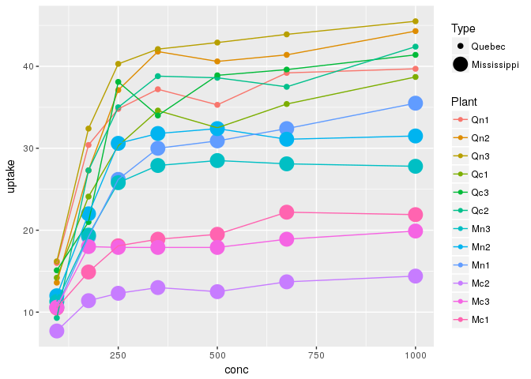

Activity 2
================
Canyon Foot
2/1/2018

``` r
head(CO2)
```

    ## Grouped Data: uptake ~ conc | Plant
    ##   Plant   Type  Treatment conc uptake
    ## 1   Qn1 Quebec nonchilled   95   16.0
    ## 2   Qn1 Quebec nonchilled  175   30.4
    ## 3   Qn1 Quebec nonchilled  250   34.8
    ## 4   Qn1 Quebec nonchilled  350   37.2
    ## 5   Qn1 Quebec nonchilled  500   35.3
    ## 6   Qn1 Quebec nonchilled  675   39.2

``` r
ggplot(CO2, aes(x = conc, y = uptake, col = Plant))+
  geom_point(aes(size = Type)) + geom_line()
```

    ## Warning: Using size for a discrete variable is not advised.


