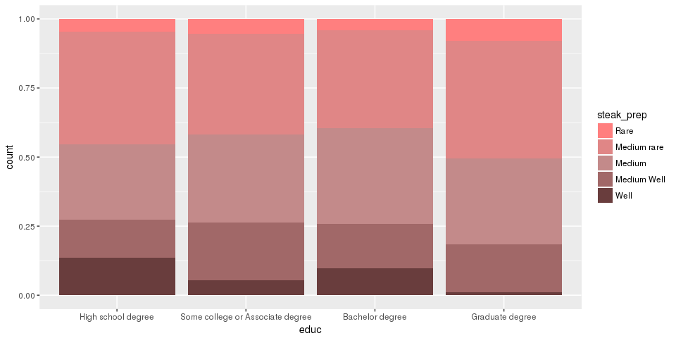
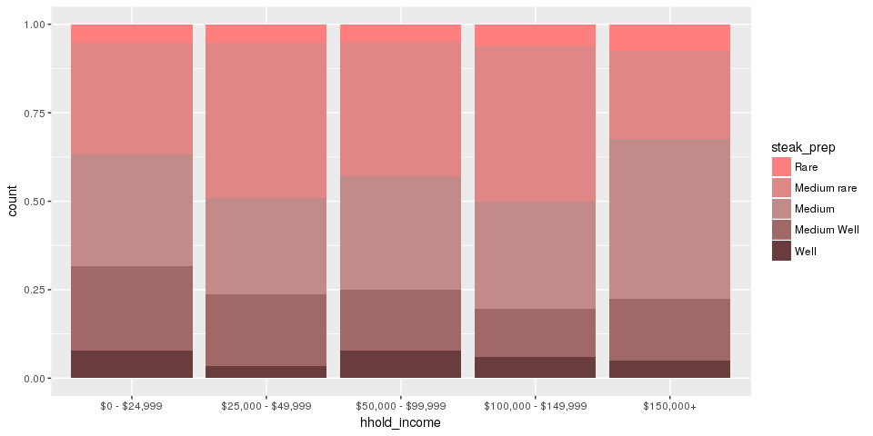
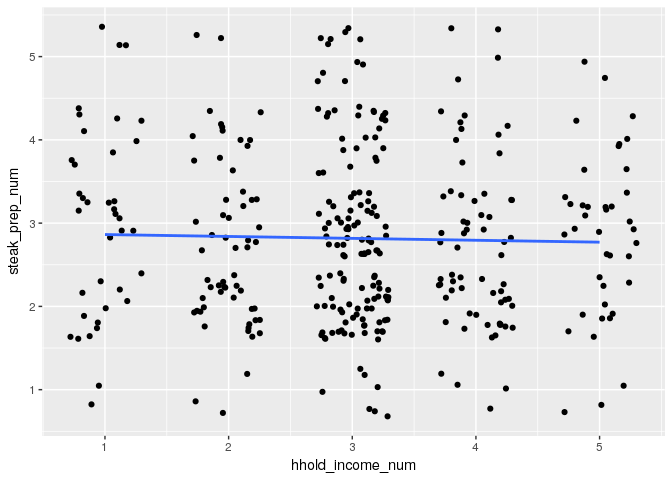
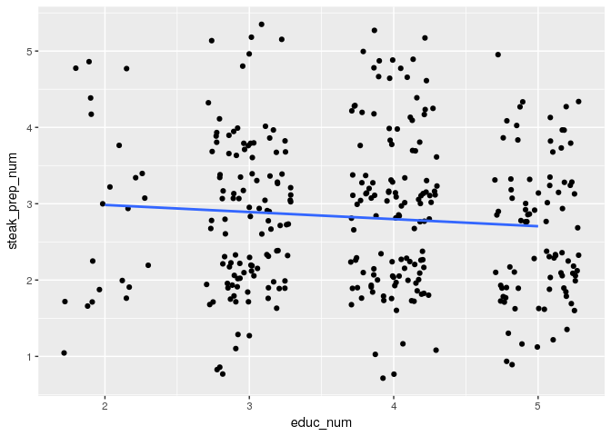
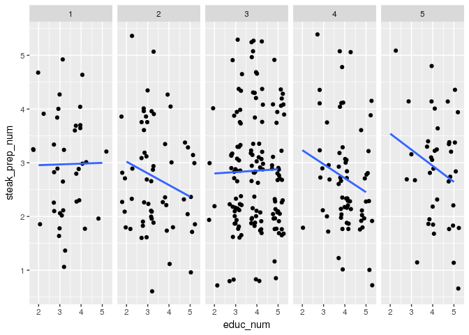
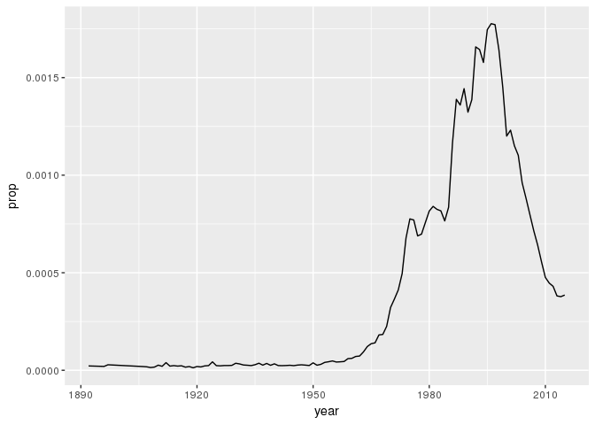
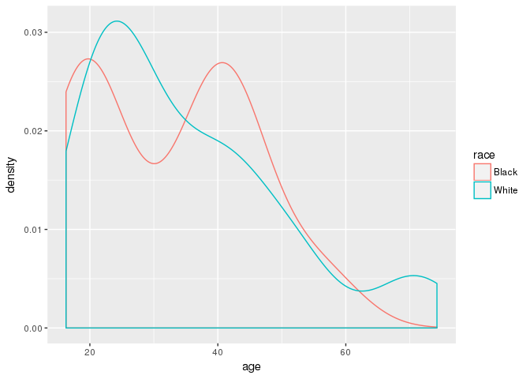
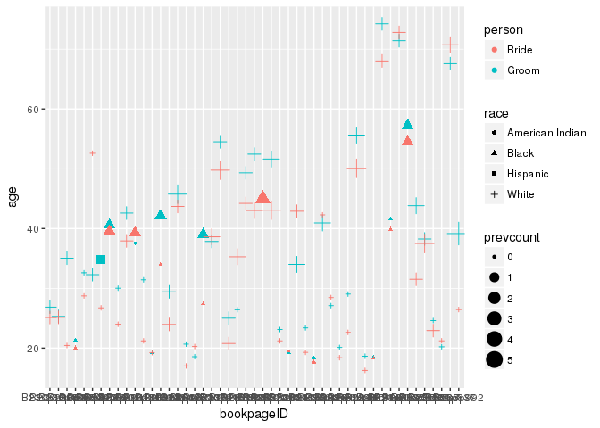
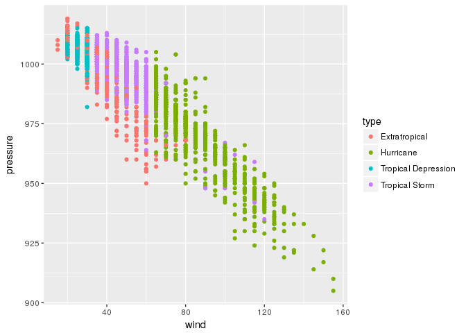

HW1
================
Canyon Foot
2/1/2018

538 Exercise:

I became interested in the relationship between income, education, and steak preference after comparing the two bar charts below. Survey respondents with a graduate degree are the most likely to order a steak rare or medium rare. However, the opposite is true of respondents in the highest income bracket, $150,000+, who were least likely to order their steak rare or medium rare. This is surprising, because in the dataset, graduate degree holders are the most likely to be in this high income bracket.

``` r
steak_colors <- c("#ff7f7f", "#e08686", "#c38a8a", "#a16868", "#693d3d")
steak_survey$educ_num<- as.numeric(steak_survey$educ)
steak_survey$steak_prep_num <- as.numeric(steak_survey$steak_prep)
steak_survey$hhold_income_num <- as.numeric(steak_survey$hhold_income)


steak_survey <- steak_survey %>% filter(educ != "Less than high school degree", steak_prep != "NA", hhold_income != "NA", educ != "NA")


ggplot(steak_survey, aes(x = educ, fill = steak_prep)) +
  geom_bar(position = "fill") +  scale_fill_manual(values = steak_colors) 
```



``` r
ggplot(steak_survey, aes(x = hhold_income, fill = steak_prep)) +
   geom_bar(position = "fill") +   scale_fill_manual(values = steak_colors) 
```

 Plotting the relationship between income and steak preference gives very little insight. The linear model is nearly completely flat, indicating either no relationship or an extremely weak one.

``` r
ggplot(steak_survey, aes(x = hhold_income_num, y = steak_prep_num)) + 
  geom_jitter(width = .3) +
  geom_smooth(method = "lm", se = FALSE)
```



The plot of steak preference and education is only slightly more revealing. The negative slope is steeper, meaning that more education predicts ordering a steak more rare, but only by a small amount, and the relationship is not significant.

``` r
ggplot(steak_survey, aes(x = educ_num, y = steak_prep_num)) + 
  geom_jitter(width = .3) +
  geom_smooth(method = "lm", se = FALSE)
```



However, by taking this second plot and faceting by income, we see that in the two highest income groups, there is a much stronger relationship between income and steak preference. This can explain the unintuitive result from the first two bar charts. In the highest income group, highly educated people are likely to order their steaks rarer, but the less educated members of the high income bracket are less likely to order their steaks rare or medium rare. In this way, even though the highly educated were proportionally over-represented in the highest income bracket, their preference for rare steak was negated by the tendency of less educated members in the same income bracket to order their steaks medium or well-done.

``` r
ggplot(steak_survey, aes(y = steak_prep_num, x = educ_num)) + geom_jitter(width = .3) + geom_smooth(method = "lm", se = FALSE) + facet_grid(. ~ hhold_income_num)
```



Out of curiosity, I applied linear models to see if any of the results were significant. The relationship between education and steak preference overall was not, but when the data set was filtered to only include respondents from the two highest income brackets, it was (p = .044). However, the relationship is not significant when filtering to include only the top bracket.

``` r
high_income <- steak_survey %>% filter(hhold_income_num > 3)
m_high = lm(steak_prep_num ~ educ_num, data = high_income)
m_full = lm(steak_prep_num ~ educ_num, data = steak_survey)
summary(m_high)
```

    ## 
    ## Call:
    ## lm(formula = steak_prep_num ~ educ_num, data = high_income)
    ## 
    ## Residuals:
    ##     Min      1Q  Median      3Q     Max 
    ## -2.0562 -0.7961 -0.0562  0.4641  2.2039 
    ## 
    ## Coefficients:
    ##             Estimate Std. Error t value Pr(>|t|)    
    ## (Intercept)   3.8366     0.5344   7.179 1.08e-10 ***
    ## educ_num     -0.2601     0.1276  -2.039    0.044 *  
    ## ---
    ## Signif. codes:  0 '***' 0.001 '**' 0.01 '*' 0.05 '.' 0.1 ' ' 1
    ## 
    ## Residual standard error: 0.9668 on 104 degrees of freedom
    ## Multiple R-squared:  0.03843,    Adjusted R-squared:  0.02918 
    ## F-statistic: 4.156 on 1 and 104 DF,  p-value: 0.04402

``` r
summary(m_full)
```

    ## 
    ## Call:
    ## lm(formula = steak_prep_num ~ educ_num, data = steak_survey)
    ## 
    ## Residuals:
    ##     Min      1Q  Median      3Q     Max 
    ## -1.9843 -0.7982  0.1088  0.2949  2.2949 
    ## 
    ## Coefficients:
    ##             Estimate Std. Error t value Pr(>|t|)    
    ## (Intercept)  3.17042    0.23699  13.378   <2e-16 ***
    ## educ_num    -0.09307    0.06065  -1.534    0.126    
    ## ---
    ## Signif. codes:  0 '***' 0.001 '**' 0.01 '*' 0.05 '.' 0.1 ' ' 1
    ## 
    ## Residual standard error: 1 on 341 degrees of freedom
    ## Multiple R-squared:  0.006858,   Adjusted R-squared:  0.003945 
    ## F-statistic: 2.355 on 1 and 341 DF,  p-value: 0.1258

Note: I got the idea to use a steak themed color palette from the original 538 article in which the dataset was used.

2.5 Using chart found at: <http://www.nytimes.com/interactive/2012/02/13/us/politics/2013-budget-proposal-graphic.html?_r=1>

1.  The immediate impression given by the chart is that the Obama budget increased spending from the previous year. This comes from the relative dominance of green circles, which indicate increased spending, over red ones, which indicate spending cuts. When you change the chart to break up spending by whether it is mandatory or discretionary, it becomes clear that the bulk of cuts went to discretionary spending while the biggest increases were in mandatory spending.

2.  The graphic uses scale, color, and coordinates to convey its information. The size of the bubbles is proportional to the amount of money allocated to the various services and programs. As mentioned in 1), the color indicates whether the spending was increased or decreased. On the chart labeled “Changes”, a coordinate system is used to denote the budget size on the x-axis and the spending changes on the y-axis. However, this chart maintains the earlier size/color system, meaning that the additional dimension of coordinates does not add any information.

3.  The visualization is certainly pretty, and the animations are pleasing, but I think there are some problems with the way it delivers its information. For one, the size of the circles is determined by the total budget for that item of spending, making the small increases in expensive programs appear larger than they are. My initial reading of the chart was that Obama had substantially increased the budget, based on the much greater area of the green bubbles. However, after checking Wikipedia, I learned that the actual increase was only of a couple percentage points. I don’t believe that this is intentionally misleading, but it is a natural consequence of not including overall spending numbers available in the graphic. I would have included a fifth chart that gives a broad overview of the budget to remedy this problem.

2.6

1.  The y-axis displays the number of women out of 100 who are likely to become pregnant with both typical and perfect use of various forms of birth control.

2.  Variables: time, birth control method, and pregnancy risk given perfect and typical use

Time is 1-10 years for all charts. Birth control method includes every major form, including condoms, copper and hormonal IUDs, and withdrawal. Pregnancy risk varies widely. Some methods are so ineffective as to virtually guarantee pregnancy after 10 years, even under perfect use. Others have fail rates of less than 2% after ten years, without any difference between perfect and typical use.
3) On the typical use curves, the color changes from grey to yellow to red, with red indicating the greatest risk for pregnancy. Position on the y-axis also measures this variable. The slope of this curve shows how quickly the risk increases a given year.

1.  There is a wide array of birth control methods available. Some methods, like the pill, are very effective, but only when used perfectly. Other, like the Sponge, Withdrawal, and Spermicides, are relatively ineffective with both perfect and typical uses. Perhaps the most common birth control method, the male condom, sits somewhere between these poles. Used perfectly, it is fairly effective, with only 18% getting pregnant after 10 years. Use condoms typically, however, and that figure jumps to 86%. The last row displays the methods that are extremely effective and do not have much opportunity for user error – meaning that their typical and perfect uses not meaningfully distinct. This row contains by far the most effective birth control options, IUDs, sterilization, and the hormonal implant.

3.3 The plot below shows the relative unpopularity of the name "Angelica", until it began to rapidly rise in popularity in the 1960s. It peaked in the mid 1990s and has been declining since.

``` r
babynames %>% filter(name == "Angelica" & sex == "F") %>%
ggplot(aes(x = year, y = prop)) +
  geom_line()
```



3.4 2) This density plot uses postion and color to convey its data. The high the density plot at a given x value, mapped to age, the higher the proportion of marriages at that age. By using color to indicate race, we can see how the distribution differs by race.

``` r
Marriage %>% filter(race == "White" | race == "Black") %>%
  ggplot(aes(x = age, color = race)) +
  geom_density()
```



``` r
ggplot(Marriage, aes(x = bookpageID, y= age, shape = race, color = person, size = prevcount)) +
  geom_point()
```



3.9

``` r
ggplot(storms, aes(x = wind, y = pressure, color = type)) +
  geom_point()
```


