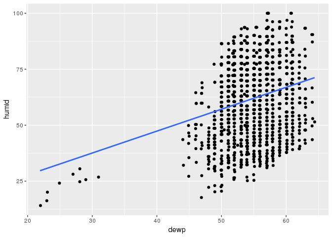
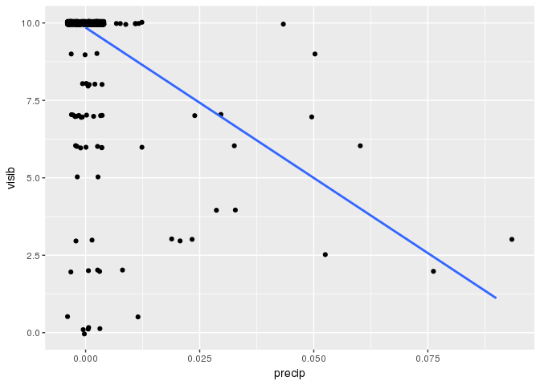

HW2
================
Canyon Foot
2/9/2018

1.  

``` r
presidential_names <- c("Grover","Benjamin","Grover","William","Theodore","William","Woodrow","Warren","Calvin","Herbert","Franklin","Harry","Dwight","John","Lyndon","Richard","Gerald","James","Ronald","George","William", "Barack")
baby_pres <- babynames %>% 
  group_by(year) %>% 
  full_join(Pres) 
```

    ## Joining, by = "year"

``` r
baby_pres <- baby_pres %>% 
  full_join(Pres_list) %>%
  mutate(ContemporaryPresTF = (name == president | name == prev_pres | name == next_pres), OverallPresTF = name %in%  c(presidential_names)) %>% 
  filter(sex == "M")
```

    ## Joining, by = "president"

``` r
baby_pres <-baby_pres %>% 
  filter(year > 1880, ContemporaryPresTF == TRUE & OverallPresTF == TRUE)

#This code combines my data into one data set and filters for names of presidents. 
# It then filters for names that were the name of the current president, the previous
# president or the next president. This is how I got the ranges of years that
# each name is displayed for.
```

``` r
plot_1960 <-baby_pres %>% 
  filter(prop < .0075 & year < 1960) %>% 
  ggplot(aes(x = year, y = prop, color = name)) + geom_line(size = 2) + labs(x = "Year", y = "Name Proportion", title = "Presidential Name Popularity 1882 - 1960                                   Black Bars Indicate End of a Presidency") +
  #making first line plot
  annotate("linerange", x = c(1884, 1888, 1892, 1900, 1912, 1920, 1923, 1928, 1932,  1945, 1952), ymin = 0, ymax = .0008) +
  
  annotate("text", x = c(1886, 1894, 1905, 1905, 1916, 1926, 1935, 1939,1950, 1955), y = c(.0023, .005, .0035, .001, .006, .0015, .0067, .0015,.0035, .0008), label = c("Grover", "Benjamin", "Theodore", "Woodrow", "Warren", "Calvin", "Herbert", "Franklin", "Harry", "Dwight"), size = 6) +
  annotate("text", x = 1956, y = .007, label = "Note: William Taft and \n William Mikinley excluded \n for scale reasons") +  theme(plot.title = element_text(size=22))
# annotating for presidental change and adding names
plot_2015 <- baby_pres %>%
  filter(year >= 1960, name != "Dwight" & name != "Theodore" & name != "Harry" & name != "Benjamin" & (name != "Ronald" | year < 1992)) %>% 
  
ggplot(aes(x = year, y = prop, color = name)) +
  geom_line(size = 2) +
  labs(x = "Year", y = "Name Proportion", title = "Presidential Name Popularity 1960 - 2015") +
   #making second line plot
  annotate("linerange", x = c(1960, 1963, 1968, 1974, 1976, 1980, 1988, 1992,2000,2008), ymin = 0, ymax = .0045) +
  
  annotate("text", x = c(1964, 1968, 1985, 1998), y = c(.035, .015, .022, .007), label = c("John", "Richard", "James", "William"), size = 6)  +
  
  annotate("text", x= c(1968, 1978, 1985, 2000, 2010), y = -.001, label = c("Lyndon", "Gerald", "Ronald", "George", "Barack"), size = 6) + theme(plot.title = element_text(size=22))
# annotating for presidental change and adding names
```

Prior to the 1960s, there was usually a strong spike in the popularity of the president's name around his election. After the 1960s this effect essentially dissapeared.

``` r
grid.arrange(plot_1960, plot_2015, nrow = 2)
```


``` r
# combining plots into one image
```

Book Exercises: 4.1

1.  Summarise
2.  Mutate
3.  Arrange
4.  filter
5.  Select

4.2 January had the highest proportion of cancelled flights, October had the lowest. This makes intuitive sense as the fall tends to have less severe weather than the winter.

``` r
flights %>% group_by(month) %>% 
  mutate(cancelled = if_else(is.na(air_time),1,0)) %>%
  summarise(cancelled_rate = sum(cancelled)/n()) %>%
  arrange(desc(cancelled_rate))
```

    ## # A tibble: 12 x 2
    ##    month cancelled_rate
    ##    <int>          <dbl>
    ##  1     1        0.0211 
    ##  2     2        0.0201 
    ##  3     5        0.00869
    ##  4    12        0.00730
    ##  5     3        0.00650
    ##  6     7        0.00601
    ##  7     8        0.00598
    ##  8     6        0.00588
    ##  9     9        0.00570
    ## 10     4        0.00513
    ## 11    11        0.00443
    ## 12    10        0.00351

4.3 The plane with tail number N223AG flew the most flights from the pnw.

``` r
flights %>% group_by(tailnum) %>% 
  summarise(total = n()) %>% 
  arrange(desc(total))
```

    ## # A tibble: 3,023 x 2
    ##    tailnum total
    ##    <chr>   <int>
    ##  1 N223AG    755
    ##  2 N218AG    749
    ##  3 N219AG    744
    ##  4 N614AS    738
    ##  5 N611AS    723
    ##  6 N224AG    713
    ##  7 N607AS    708
    ##  8 N619AS    696
    ##  9 N613AS    694
    ## 10 N644AS    691
    ## # ... with 3,013 more rows

``` r
flights %>% filter(tailnum == "N223AG") %>% 
  group_by(month) %>% summarise(total = n()) %>% 
  ggplot(aes(x= month, y = total)) + geom_line()
```


4.4 The oldest plane has tailnum "N201AA". There is a total of 2628 planes listed in the planes table.

``` r
planes %>% filter(year > 0) %>% 
  full_join(flights, "tailnum")  %>%
  arrange(year.x)
```

    ## # A tibble: 162,049 x 24
    ##    tailnum year.x type      manufacturer model engines seats speed engine 
    ##    <chr>    <int> <chr>     <chr>        <chr>   <int> <int> <int> <chr>  
    ##  1 N201AA    1959 Fixed wi… CESSNA       150         1     2    90 Recipr…
    ##  2 N201AA    1959 Fixed wi… CESSNA       150         1     2    90 Recipr…
    ##  3 N201AA    1959 Fixed wi… CESSNA       150         1     2    90 Recipr…
    ##  4 N201AA    1959 Fixed wi… CESSNA       150         1     2    90 Recipr…
    ##  5 N201AA    1959 Fixed wi… CESSNA       150         1     2    90 Recipr…
    ##  6 N201AA    1959 Fixed wi… CESSNA       150         1     2    90 Recipr…
    ##  7 N201AA    1959 Fixed wi… CESSNA       150         1     2    90 Recipr…
    ##  8 N201AA    1959 Fixed wi… CESSNA       150         1     2    90 Recipr…
    ##  9 N201AA    1959 Fixed wi… CESSNA       150         1     2    90 Recipr…
    ## 10 N201AA    1959 Fixed wi… CESSNA       150         1     2    90 Recipr…
    ## # ... with 162,039 more rows, and 15 more variables: year.y <int>,
    ## #   month <int>, day <int>, dep_time <int>, dep_delay <dbl>,
    ## #   arr_time <int>, arr_delay <dbl>, carrier <chr>, flight <int>,
    ## #   origin <chr>, dest <chr>, air_time <dbl>, distance <dbl>, hour <dbl>,
    ## #   minute <dbl>

4.5 61 planes have missing years of manufacture. Boeing, Airbus Industrie, Airbus, Bombardier Inc, and McDonnel Douglas are the most popular manufacturers.

For all manufacturers, production was highest around the year 2000. Since then, Boeing has dominated the market, with AirBus a fairly distant second.

``` r
planes %>% filter(year == 0 | is.na(year))
```

    ## # A tibble: 61 x 9
    ##    tailnum  year type      manufacturer  model  engines seats speed engine
    ##    <chr>   <int> <chr>     <chr>         <chr>    <int> <int> <int> <chr> 
    ##  1 N174US     NA Fixed wi… AIRBUS INDUS… A321-…       2   199    NA Turbo…
    ##  2 N177US     NA Fixed wi… AIRBUS INDUS… A321-…       2   199    NA Turbo…
    ##  3 N181UW     NA Fixed wi… AIRBUS INDUS… A321-…       2   199    NA Turbo…
    ##  4 N194UW     NA Fixed wi… AIRBUS        A321-…       2   199    NA Turbo…
    ##  5 N235SW      0 Fixed wi… EMBRAER       EMB-1…       2    32    NA Turbo…
    ##  6 N271LV     NA Fixed wi… BOEING        737-7…       2   149    NA Turbo…
    ##  7 N298WN     NA Fixed wi… BOEING        737-7…       2   140    NA Turbo…
    ##  8 N299WN     NA Fixed wi… BOEING        737-7…       2   140    NA Turbo…
    ##  9 N331NB     NA Fixed wi… AIRBUS INDUS… A319-…       2   145    NA Turbo…
    ## 10 N33292     NA Fixed wi… BOEING        737-8…       2   149    NA Turbo…
    ## # ... with 51 more rows

``` r
# planes without year
planes %>% group_by(manufacturer) %>% summarise(total=n_distinct(tailnum)) %>% arrange(desc(total))
```

    ## # A tibble: 19 x 2
    ##    manufacturer                  total
    ##    <chr>                         <int>
    ##  1 BOEING                         1460
    ##  2 AIRBUS INDUSTRIE                401
    ##  3 AIRBUS                          397
    ##  4 BOMBARDIER INC                  214
    ##  5 MCDONNELL DOUGLAS                94
    ##  6 EMBRAER                          37
    ##  7 CANADAIR                          8
    ##  8 CESSNA                            4
    ##  9 MCDONNELL DOUGLAS AIRCRAFT CO     2
    ## 10 PIPER                             2
    ## 11 BARKER JACK L                     1
    ## 12 BELL                              1
    ## 13 CIRRUS DESIGN CORP                1
    ## 14 GULFSTREAM AEROSPACE              1
    ## 15 KILDALL GARY                      1
    ## 16 LAMBERT RICHARD                   1
    ## 17 MARZ BARRY                        1
    ## 18 ROBINSON HELICOPTER CO            1
    ## 19 SIKORSKY                          1

``` r
planes %>% filter(year > 1960, !is.na(manufacturer)) %>% 
  group_by(manufacturer, year) %>% 
  summarise(total=n_distinct(tailnum)) %>% 
  mutate(manufacturer2 = if_else(!(manufacturer %in% c("AIRBUS", "AIRBUS INDUSTRIE", "BOEING", "BOMBARDIER INC", "MCDONNELL DOUGLAS")), "Other", manufacturer)) %>%
  
  # creating other catagory
  ggplot(aes(x = year, y = total, color = manufacturer2)) +
  geom_line()
```


The temperature distribution is centered around 65 degrees, and is right skewed.

The relationship between dew point and humidity is positive and fairly weak, the relationship between visibility and precipitation is negative and moderate.

``` r
weather %>% filter(month == 7) %>% 
  ggplot(aes(x = temp)) + geom_histogram(binwidth = 5)
```


``` r
# histogram
weather %>% filter(month == 7) %>% 
  ggplot(aes(x = dewp, y = humid)) + 
  geom_jitter() +
  geom_smooth(se = FALSE, method = "lm")
```



``` r
weather %>% filter(month == 7, precip< .10) %>% 
  ggplot(aes(x = precip, y = visib)) + 
  geom_jitter() + 
  geom_smooth(se = FALSE, method = "lm")
```



``` r
# scatterplots
```
