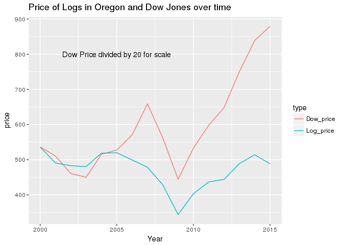
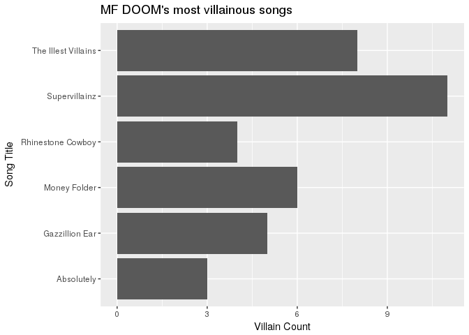
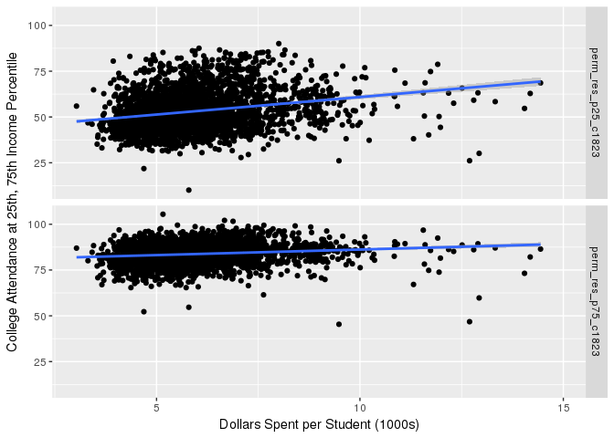

hw4
================
Canyon Foot
2/24/2018

``` r
Logs <- Logs %>% 
  mutate(price = parse_number(`Pond Value`)) %>%
  select(price, Species, Region, Grade, Year) %>%
  filter(Year < 2016) %>%
  group_by(Year) %>%
  summarise(Log_price = mean(price, na.rm = TRUE))
# Tidying and organizing Logs data

Dow <- Dow %>% 
  separate(Date, c("Day", "Month", "Year"), sep = "/", convert = TRUE) %>% 
  mutate(Dow_Price = Close, Year = Year + 2000) %>%
  select(Year, Dow_Price) %>%
  group_by(Year) %>%
  summarise(Dow_price = mean(Dow_Price) / 20)
# tidying and organizing Dow, dividing by 20 so the scales are similar

LogsDow <- full_join(Dow, Logs) %>% 
  gather(2:3, key = type, value = price)
```

    ## Joining, by = "Year"

``` r
# Joining

LogsDow %>%
ggplot(aes(x = Year, y = price, color = type)) + 
  geom_line() + 
  annotate("text", x = 2005, y = 800, label = "Dow Price divided by 20 for scale" ) + 
  labs(title = "Price of Logs in Oregon and Dow Jones over time")
```



``` r
MFDOOM <- get_artist_songs(70)
MADVIL <- get_artist_songs(150)
KINGG <- get_artist_songs(708)
VIKTORV <- get_artist_songs(712)
# various alternate names
# this section uses the genius API to get lyrics and songs


FULLDOOM <- rbind(MFDOOM, MADVIL, KINGG, VIKTORV) %>%
  filter(annotation_count > 5)
# filtering for songs with lyrics, as many are purely instrumental, as well as excluding songs 


DOOMSONGS <- FULLDOOM %>% 
  select(song_id, song_name, song_lyrics_url) %>%
  filter(!(song_id %in% c(2825757, 1459112, 2264509, 2344221, 413191, 3819, 3822)))
# filtering out 'songs' that didn't work in the scrape. Mostly weird filler stuff rather than actual music


DOOM_lyrics <- scrape_lyrics_url(DOOMSONGS$song_lyrics_url[1])
n = 2
while (n < 111) {
  temp_lyric <- scrape_lyrics_url(DOOMSONGS$song_lyrics_url[n])
  DOOM_lyrics <- rbind(DOOM_lyrics, temp_lyric)
  n = n + 1
}
#scraping lyrics, each line is entered as a row
```

MF DOOM is a British-American rapper and producer who was most active between 1999 and 2005. During this period, he created music under various names. Frequently, he made refrences (through lyrics as well as samples) to his persona as DOOM, a masked villain originating from the Fantastic Four comics. In keeping with this persona, the rapper wears a metal mask, hence MF - "Metal Face". Perhaps DOOMs best known work is his 2004 album 'Madvillainy', a collaborative effort with rapper/producer Madlib, released under the name 'Madvillain' to critical acclaim. I was curious which of DOOM's songs use the word 'Villain' so I made this chart.

``` r
DOOM_lyrics %>% 
  filter(str_detect(line, "villain|Villain")) %>%
  group_by(song_name) %>% 
  summarise(vil = n()) %>% 
  arrange(desc(vil)) %>%
  head(6) %>% 
  tidyr::uncount(vil) %>% 
  ggplot(aes(x = song_name)) + 
  geom_bar() +
  coord_flip() +
  labs(y = "Villain Count", x = "Song Title", title = "MF DOOM's most villainous songs")
```



``` r
# assembling plot
```

``` r
Counties <- Counties %>% 
  select(ccd_exp_tot, perm_res_p25_c1823, perm_res_p75_c1823) %>% 
  gather(2:3, key = percentile, value = college_attd) 
# This was originally a dataset with every county in the US and over 600 columns, here I am selecting the variables for education spending per student and college attendance at the 25th and 75th percentiles. I gathered them to make faceting easier

Counties %>%  filter(ccd_exp_tot < 15) %>%
  # Remove Outliers
ggplot(aes(x = ccd_exp_tot, y = college_attd)) +
  geom_point() + 
  geom_smooth(method = "lm") + 
  facet_grid(percentile ~ .) +
  labs(y = "College Attendance at 25th, 75th Income Percentile", x = "Dollars Spent per Student (1000s)")
```

    ## Warning: Removed 374 rows containing non-finite values (stat_smooth).

    ## Warning: Removed 374 rows containing missing values (geom_point).



``` r
# Plotting
```
