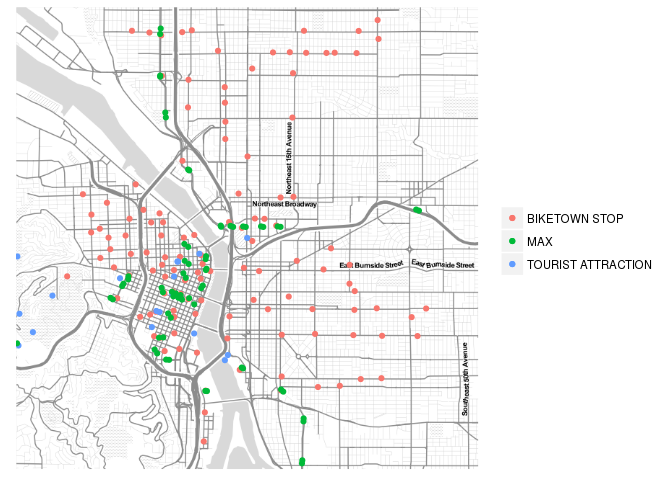

HW7
================
Canyon Foot
4/3/2018

``` r
# Getting station JSON and Map
bike_stations <- fromJSON("http://biketownpdx.socialbicycles.com/opendata/station_information.json")


library(ggmap)
m <- get_map("Oregon Convention Center Portland, Oregon", zoom = 13, scale = 4, maptype = "toner-lite")
```

    ## maptype = "toner-lite" is only available with source = "stamen".

    ## resetting to source = "stamen"...

    ## Map from URL : http://maps.googleapis.com/maps/api/staticmap?center=Oregon+Convention+Center+Portland,+Oregon&zoom=13&size=640x640&scale=2&maptype=terrain&sensor=false

    ## Information from URL : http://maps.googleapis.com/maps/api/geocode/json?address=Oregon%20Convention%20Center%20Portland,%20Oregon&sensor=false

    ## Map from URL : http://tile.stamen.com/toner-lite/13/1303/2928.png

    ## Map from URL : http://tile.stamen.com/toner-lite/13/1304/2928.png

    ## Map from URL : http://tile.stamen.com/toner-lite/13/1305/2928.png

    ## Map from URL : http://tile.stamen.com/toner-lite/13/1306/2928.png

    ## Map from URL : http://tile.stamen.com/toner-lite/13/1303/2929.png

    ## Map from URL : http://tile.stamen.com/toner-lite/13/1304/2929.png

    ## Map from URL : http://tile.stamen.com/toner-lite/13/1305/2929.png

    ## Map from URL : http://tile.stamen.com/toner-lite/13/1306/2929.png

    ## Map from URL : http://tile.stamen.com/toner-lite/13/1303/2930.png

    ## Map from URL : http://tile.stamen.com/toner-lite/13/1304/2930.png

    ## Map from URL : http://tile.stamen.com/toner-lite/13/1305/2930.png

    ## Map from URL : http://tile.stamen.com/toner-lite/13/1306/2930.png

    ## Map from URL : http://tile.stamen.com/toner-lite/13/1303/2931.png

    ## Map from URL : http://tile.stamen.com/toner-lite/13/1304/2931.png

    ## Map from URL : http://tile.stamen.com/toner-lite/13/1305/2931.png

    ## Map from URL : http://tile.stamen.com/toner-lite/13/1306/2931.png

``` r
trimet <- read_csv("~/canyon-foot/homework/tm_stops.csv")
```

    ## Parsed with column specification:
    ## cols(
    ##   X = col_double(),
    ##   Y = col_double(),
    ##   stop_id = col_integer(),
    ##   stop_name = col_character(),
    ##   jurisdic = col_character(),
    ##   zipcode = col_integer(),
    ##   type = col_character()
    ## )

``` r
# Creating data frame of stations
stations <- data.frame(bike_stations[["data"]][["stations"]][["station_id"]], bike_stations[["data"]][["stations"]][["lon"]],bike_stations[["data"]][["stations"]][["lat"]])

names(stations) <- c("ID", "Long", "Lat")
```

``` r
# Adding tourist attractions
library(readxl)
Tourist_Attractions <- read_excel("~/canyon-foot/homework/Tourist Attractions.xlsx") %>% mutate(type = "TOURIST ATTRACTION")

fulldata <- stations %>%
  mutate(type = "BIKETOWN STOP") %>%
  bind_rows(Tourist_Attractions)
```

``` r
# Making plot
trimet2 <- trimet %>%
  filter(type == "MAX")
ggmap(m) + geom_point(data = fulldata, aes(x = Long, y = Lat, color = type)) +
  geom_point(data = trimet2, aes(x = X, y = Y, color = type)) +
  theme(axis.title.x=element_blank(),
        axis.text.x=element_blank(),
        axis.ticks.x=element_blank(),
        axis.title.y=element_blank(),
        axis.text.y=element_blank(),
        axis.ticks.y=element_blank(),
        legend.title=element_blank())
```

    ## Warning: Removed 7 rows containing missing values (geom_point).

    ## Warning: Removed 99 rows containing missing values (geom_point).



Our choice to use Biketown data was a pretty obvious one, as we are both members of the Biketown 2 group. We had been playing around with the live Biketown feed, and found it was quite easy to put the stop information, including coordinates, into a data frame. Once we had a map of the locations, we noticed they seemed to be more concentrated in commercial areas. We wondered if the locations of prominent tourist locations (entered manually based on a list we found online) in Portland would map closely to Biketown stops, which, excluding those in Washington Park, they generally did. However, since most tourist locations were downtown, and thus very close together, it is difficult to draw many conclusions from this fact. We felt the map was not complete, so we downloaded files containing all Trimet stop locations, and plotted those too. Unsurprisingly, the bus stops vastly outnumbered any other form of transit, and so we filtered for only MAX stations to reduce clutter. The resulting map gives some interesting information. For one, if you are a tourist coming to Portland, you are probably best off sticking downtown and perhaps taking a trip to Washington Park, as those locations have the bulk of Portland’s attractions. Additionally, for this purpose, Biketown seems like a pretty good option, and is actually substantially better than the MAX in terms of number of stops and the locations you can access. However, as mentioned earlier, the Trimet bus is by far the best option for those looking to venture beyond downtown.
