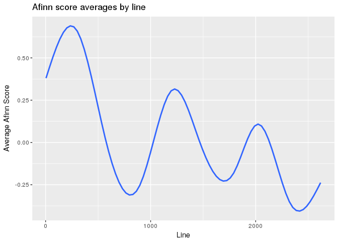
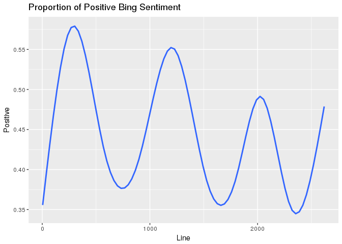

HW8
================
Canyon
4/15/2018

Much of the code for the first problems was copied from the slides. I hope that's ok.

``` r
liz_stop_words <- read_table("https://raw.githubusercontent.com/BryanBumgardner/gutenburg_nlp/master/stopwords_elizabethan", col_names = "word") 
```

    ## Parsed with column specification:
    ## cols(
    ##   word = col_character()
    ## )

``` r
macbeth <- read_table("http://www.gutenberg.org/cache/epub/1129/pg1129.txt") 
```

    ## Parsed with column specification:
    ## cols(
    ##   `This Etext file is presented by Project Gutenberg, in` = col_character()
    ## )

``` r
names(macbeth) <- "line"
macbeth <- unlist(macbeth)

macdf <- data_frame(text = macbeth[279:3170]) %>%
  na.omit()
```

``` r
speaker_pat <- "[A-Z]*\\s?[A-Z]*\\s?[A-Z]{3,}\\.\\s"
speakers <- grep(pattern = speaker_pat, x = macbeth[279:3170], value = TRUE) %>%
  str_extract(speaker_pat)
```

``` r
not_char_idx <- c(15, 16, 22)
chars <- unique(speakers)[-not_char_idx]
```

``` r
roster <- paste0("(", paste(chars, collapse = ")|("), ")")
turns <- macdf %>%
  unnest_tokens(output = text, input = text, token = "regex", pattern = roster)

speaker <- grep(pattern = roster,
                 x = macdf$text, value = TRUE) %>%
  str_extract(roster)
```

``` r
turns <- (turns %>%
  mutate(speaker = str_extract(speaker, "[A-Z]*\\s?[A-Z]*\\s?[A-Z]+")) %>%
  select(speaker, text))
```

1:

``` r
mac_turns <- turns %>%
  filter(speaker %in% c("MACBETH", "LADY MACBETH"))

mac_words <- mac_turns %>% 
   unnest_tokens(output = word, input = text, token = "words") %>%
  filter(!(word %in% stop_words$word) & !(word %in% liz_stop_words$word))
```

According to the calculations below, the aveage word spoken by Macbeth has a afinn score of -.513, and 38.4% of Macbeth's words are listed as positive by bing. Lady Macbeth appears to be slightly more negative, with a mean afinn score of -.691 and 35.1% positive words.

``` r
mac_words %>%
  filter(speaker == "MACBETH") %>%
  inner_join(get_sentiments("bing")) %>%
  inner_join(get_sentiments("afinn")) %>%
  summarise(mean(score), mean(sentiment == "positive"))
```

    ## Joining, by = "word"
    ## Joining, by = "word"

    ## # A tibble: 1 x 2
    ##   `mean(score)` `mean(sentiment == "positive")`
    ##           <dbl>                           <dbl>
    ## 1        -0.514                           0.384

``` r
mac_words %>%
  filter(speaker == "LADY MACBETH") %>%
  inner_join(get_sentiments("bing")) %>%
  inner_join(get_sentiments("afinn")) %>%
  summarise(mean(score), mean(sentiment == "positive"))
```

    ## Joining, by = "word"
    ## Joining, by = "word"

    ## # A tibble: 1 x 2
    ##   `mean(score)` `mean(sentiment == "positive")`
    ##           <dbl>                           <dbl>
    ## 1        -0.691                           0.351

2: Both Afinn and Bing sentiment analysis reveal a similar pattern in Macbeth. The Afinn scores seem to produce a stronger effect. Perhaps this is because the numerical score gives more weight to particularly negative words relating to topics like death and murder, that do not have many equivalently positive counter-parts in Macbeth.

``` r
macdf$line <- seq.int(nrow(macdf))

macdf <- macdf %>% 
 unnest_tokens(output = word, input = text, token = "words")

macdf %>% 
 inner_join(get_sentiments("afinn")) %>%
  group_by(line) %>%
  filter(score != 0) %>%
  summarise(score_mean = mean(score)) %>%
  ggplot(aes(x = line, y = score_mean)) +
  geom_smooth(se = F) +
  labs(title = "Afinn score averages by line", y = "Average Afinn Score", x = "Line")
```

    ## Joining, by = "word"

    ## `geom_smooth()` using method = 'gam'



``` r
macdf %>% 
 inner_join(get_sentiments("bing")) %>%
  group_by(line) %>%
  filter(sentiment != 0) %>%
  summarise(score_mean = mean(sentiment == "positive")) %>%
  ggplot(aes(x = line, y = score_mean)) +
  geom_smooth(se = F) +
  labs(title = "Proportion of Positive Bing Sentiment", y = "Positive", x = "Line")
```

    ## Joining, by = "word"
    ## `geom_smooth()` using method = 'gam'



3:

``` r
complete_shake <- read_table("https://www.gutenberg.org/files/100/100-0.txt") %>%
  filter(X1 != "") 
```

    ## Warning: Missing column names filled in: 'X1' [1]

    ## Parsed with column specification:
    ## cols(
    ##   X1 = col_character()
    ## )

``` r
complete_shake <- data_frame(complete_shake$X1)
names(complete_shake) <- "text"
comp <- data_frame(text = complete_shake$text)
```

``` r
comp <- comp %>%
  unnest_tokens(output = word, input = text, token = "regex")
```

All but "mannerly-modest" are found in the hyph dataset. I could not find this phrase in the complete Shakespeare file either.

``` r
hyph <- grep("([a-z, A-Z]{3,}\\-)\\w{3,}", comp$word[157:959744], value = T)
head(hyph)
```

    ## [1] "self-substantial" "all-eating"       "self-love"       
    ## [4] "never-resting"    "self-killed:"     "self-willed"

``` r
machine <- c("basilisco-like", "fiend-like", "devilish-holy", "heart-sore", "sea-room", "feast-won", "mannerly-modest", "daring-hardy")

hyph <- gsub("\\,|\\.", "", x = hyph)
hyph <- data_frame(hyph)

filter(hyph, hyph %in% machine) %>%
  distinct()
```

    ## # A tibble: 7 x 1
    ##   hyph          
    ##   <chr>         
    ## 1 basilisco-like
    ## 2 fiend-like    
    ## 3 devilish-holy 
    ## 4 sea-room      
    ## 5 daring-hardy  
    ## 6 feast-won     
    ## 7 heart-sore

Top 5 hyphenated words:

``` r
hyph %>% 
  group_by(hyph) %>%
  summarise(count = n()) %>% 
  arrange(desc(count)) %>%
  head(5)
```

    ## # A tibble: 5 x 2
    ##   hyph         count
    ##   <chr>        <int>
    ## 1 self-same       19
    ## 2 serving-man     18
    ## 3 market-place    12
    ## 4 tongue-tied     12
    ## 5 coal-black       8

4:

``` r
# A couple words/names that ranked highly but I didn't feel were relevant
misc <- c( "first", "one", "two", "three", "second", "hamlet", "coriolanus", "brutus", "desdemona", "mercy", "good", "falstaff")


nouns <- read.table("~/canyon-foot/homework/91K nouns.txt")
verbs <- read.table("~/canyon-foot/homework/31K verbs.txt")
nouns$V1 <- tolower(nouns$V1)
verbs$V1 <- tolower(verbs$V1)


comp_2gram <- complete_shake %>%
  unnest_tokens(output = word, input = text, token = "ngrams", n = 2)
insults <- grep("^you\\s", comp_2gram$word[157:959744], value = T)

insults <- data_frame(insult = insults)
```

Top 5 Insults:

``` r
insults %>% 
  separate(insult, sep = " ", into = c("you", "other_word")) %>%
  filter(other_word %in% nouns$V1 & !(other_word %in% verbs$V1) & !(other_word %in% liz_stop_words$word) & !(other_word %in% misc)) %>%
  unite("insult", sep = " ") %>%
  group_by(insult) %>%
  summarise(count = n()) %>%
  arrange(desc(count)) %>%
  head(5)
```

    ## # A tibble: 5 x 2
    ##   insult       count
    ##   <chr>        <int>
    ## 1 you sir        221
    ## 2 you madam       27
    ## 3 you gods        23
    ## 4 you whoreson    14
    ## 5 you duke        10

5:

``` r
it <- 10
for (i in 1:it) {
  print(sample(insults_final$insult, size = 8))
  Sys.sleep(5)
}
```
