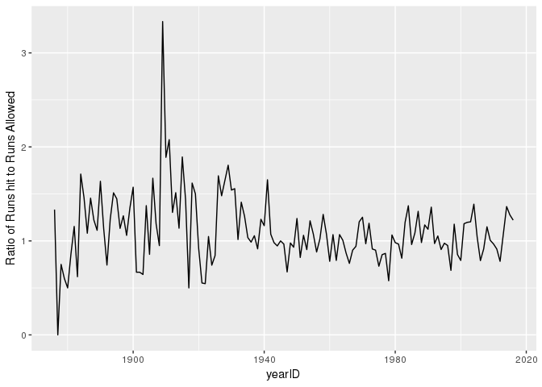
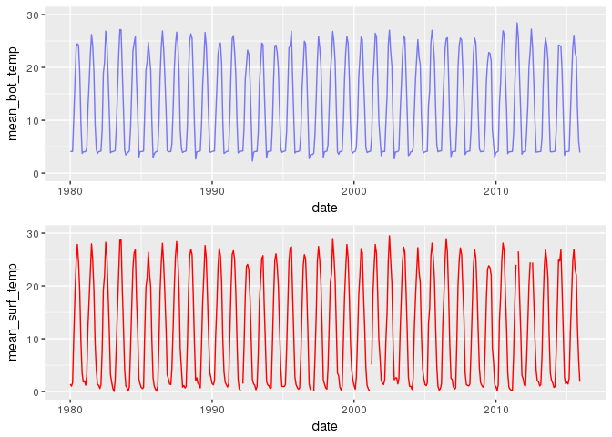

HW\_3
================
Canyon Foot
2/22/2018

5.1

``` r
Teams %>%
  select(yearID, teamID, HRA, HR) %>%
  filter(teamID == "CHN") %>%
  mutate(RunRatio = HR/HRA) %>%
  ggplot(aes(x = yearID, y = RunRatio)) + geom_line() + labs(y = "Ratio of Runs hit to Runs Allowed")
```



``` r
# this is all pretty standard, but I wasn't sure where the reshaping was supposed to
# take place, as the data was already in the format of one observation per row, with
# each row as a team in a season.
```

5.2

``` r
count_seasons <- function(team) {
  Teams %>% 
    filter(teamID == team) %>%
    summarise(total_seasons = n())
}
count_seasons("CHN")
```

    ##   total_seasons
    ## 1           141

``` r
# Again, pretty self explanatory
```

5.7

``` r
grp <- c("A", "A", "B", "B")
sex <- c("F", "M", "F", "M")
meanL <- c(.22, .47, .33, .55)
sdL <- c(.11,.33,.11,.31)
meanR <- c(.34,.47,.40,.65)
sdR <- c(.08,.33,.07,.27)

long <- data.frame(grp,sex,meanL,sdL,meanR,sdR)

long %>% 
  gather(key = type, value = number, 3:6) %>% 
  unite(sex_type, c(sex,type), sep = ".") %>% 
  spread(key = sex_type, value = number)
```

    ##   grp F.meanL F.meanR F.sdL F.sdR M.meanL M.meanR M.sdL M.sdR
    ## 1   A    0.22    0.34  0.11  0.08    0.47    0.47  0.33  0.33
    ## 2   B    0.33    0.40  0.11  0.07    0.55    0.65  0.31  0.27

``` r
# I wasn't sure whether we needed to or not but I decided to recreate the dataset
# so that I could be sure of what my transformations did.
# I ended up using unite() to get the column names in the format X.Y
```

5.15

``` r
babynames <- babynames %>% mutate(sex = (if_else(sex == "F", "FEMALE", "MALE")))
# I didn't like the idea of have a column name "F" because thats a boolean value
# so I renamed to "FEMALE" and "MALE"

babynames1 <- babynames %>% 
  group_by(year, name) %>% 
  mutate(total = n()) %>%
  filter(total == 2) %>% 
  select(-total, -n)
# Here I am filtering out all of the years in which a name was given to only one sex
# this way, the dataset contains only names with both a M and F value, so I can always
# get the ratio

babynames1 <- babynames1 %>% mutate(new_prop = prop) %>% select(-prop)
# I was having some issues that I thought may have been related to the column
# being named "prop" since prop is also the name of a function, so I renamed 
# prop to "new_prop"
  babynames1 %>% 
    spread(key = "sex", value = "new_prop") %>% 
  filter(MALE > .0001 & FEMALE > .0001) %>%
# The filter here is to exclude names that are unisex only because they are very
# rare, I was more interested in popular unisex names.
  mutate(ratio = FEMALE/MALE, normed_ratio = if_else(ratio > 1, 1/ratio, ratio)) %>%
# Creating ratio, then creating new variable such that the ratio is always has the 
# larger proportion as the denominator, and therefore is always < 1
  group_by(name) %>%
  summarise(avg_gender_ratio = mean(normed_ratio)) %>%
  # taking average over all years present
  arrange(desc(avg_gender_ratio))
```

    ## # A tibble: 353 x 2
    ##    name     avg_gender_ratio
    ##    <chr>               <dbl>
    ##  1 Dell                0.989
    ##  2 Oakley              0.982
    ##  3 Kenyatta            0.958
    ##  4 Infant              0.954
    ##  5 Lonie               0.944
    ##  6 Dominque            0.932
    ##  7 Devyn               0.926
    ##  8 Baby                0.925
    ##  9 Azariah             0.921
    ## 10 Elisha              0.915
    ## # ... with 343 more rows

5.16

``` r
thermal2 <- thermal %>% 
  select(Year, starts_with("mean_bot"), -contains("jas"))

thermal3 <- thermal %>% 
  select(Year, starts_with("mean_surf"), -contains("jas"))
# Breaking into surf and bottom temp datasets

therm2 <- thermal2 %>% 
  gather(mean_bot_jan:mean_bot_dec, key = month, value = mean_bot_temp) %>%
  arrange(Year) %>%
  mutate(month = substring(month, 10,12)) %>%
  # extracting month from string
  unite(date1, c(Year,month), sep = "-") %>%
  mutate(date = lubridate::ymd(date1, truncated = 1)) %>%
  select(-date1)
#creating dates with lubridate and separte
therm3 <- thermal3 %>% 
  gather(mean_surf_jan:mean_surf_dec, key = month, value = mean_surf_temp) %>%
  arrange(Year) %>%
  mutate(month = substring(month, 11,13)) %>%
  unite(date1, c(Year,month), sep = "-") %>%
  mutate(date = lubridate::ymd(date1, truncated = 1)) %>%
  select(-date1)
# doing same things to surface temp dataset

full_therm <- full_join(therm2, therm3)
```

    ## Joining, by = "date"

``` r
# joining the two
full_therm <- full_therm[,c(2,1,3)]
# rearrange columns 
full_therm
```

    ## # A tibble: 432 x 3
    ##    date       mean_bot_temp mean_surf_temp
    ##    <date>             <dbl>          <dbl>
    ##  1 1980-01-01          4.11           1.42
    ##  2 1980-02-01          4.11           1.03
    ##  3 1980-03-01          4.12           1.65
    ##  4 1980-04-01         10.5           10.5 
    ##  5 1980-05-01         17.1           18.3 
    ##  6 1980-06-01         23.8           24.5 
    ##  7 1980-07-01         24.5           27.9 
    ##  8 1980-08-01         24.2           24.5 
    ##  9 1980-09-01         18.9           19.0 
    ## 10 1980-10-01          9.48           9.49
    ## # ... with 422 more rows

``` r
# This is what the data now looks like
bot_plot <- full_therm %>% ggplot(aes(x = date)) + 
  geom_line(aes(y = mean_bot_temp), col = "blue", alpha = .5)  + 
  ylim(c(0,30))
  
surf_plot <- full_therm %>% ggplot(aes(x = date, y = mean_surf_temp)) + 
  geom_line(col = "red") + 
  ylim(c(0,30))
#plot
grid.arrange(bot_plot, surf_plot, nrow = 2)
```


