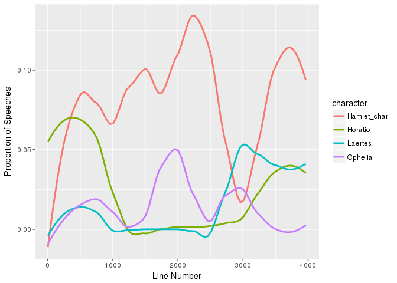

HW7Work
================
Canyon
4/9/2018

``` r
gutenberg_works(author == "Shakespeare, William")
```

    ## # A tibble: 79 x 8
    ##    gutenberg_id title    author gutenberg_autho… language gutenberg_books…
    ##           <int> <chr>    <chr>             <int> <chr>    <chr>           
    ##  1         1041 Shakesp… Shake…               65 en       <NA>            
    ##  2         1045 Venus a… Shake…               65 en       <NA>            
    ##  3         1500 King He… Shake…               65 en       <NA>            
    ##  4         1501 History… Shake…               65 en       <NA>            
    ##  5         1502 The His… Shake…               65 en       <NA>            
    ##  6         1503 The Tra… Shake…               65 en       <NA>            
    ##  7         1504 The Com… Shake…               65 en       <NA>            
    ##  8         1505 The Rap… Shake…               65 en       <NA>            
    ##  9         1507 The Tra… Shake…               65 en       <NA>            
    ## 10         1508 The Tam… Shake…               65 en       <NA>            
    ## # ... with 69 more rows, and 2 more variables: rights <chr>,
    ## #   has_text <lgl>

``` r
gutenberg_works(title == "Macbeth")
```

    ## # A tibble: 1 x 8
    ##   gutenberg_id title  author    gutenberg_autho… language gutenberg_books…
    ##          <int> <chr>  <chr>                <int> <chr>    <chr>           
    ## 1         1533 Macbe… Shakespe…               65 en       Opera           
    ## # ... with 2 more variables: rights <chr>, has_text <lgl>

``` r
macbeth <- gutenberg_download(1533)
```

    ## Determining mirror for Project Gutenberg from http://www.gutenberg.org/robot/harvest

    ## Using mirror http://aleph.gutenberg.org

``` r
macbeth <- macbeth %>%
  slice(271:3171)
```

Macbeth Activity

``` r
grep("MAC\\w{4}\\.", macbeth$text, value = T) %>%
  head(10)
```

    ##  [1] "MACBETH." "MACBETH." "MACBETH." "MACBETH." "MACBETH." "MACBETH."
    ##  [7] "MACBETH." "MACBETH." "MACBETH." "MACBETH."

``` r
grep("[is]", macbeth$text, value = T) %>%
  head(10)
```

    ##  [1] "Thus do go about, about:"                         
    ##  [2] "Thrice to thine, and thrice to mine,"             
    ##  [3] "And thrice again, to make up nine:--"             
    ##  [4] "Peace!--the charm's wound up."                    
    ##  [5] "So foul and fair a day I have not seen."          
    ##  [6] "How far is't call'd to Forres?--What are these"   
    ##  [7] "So wither'd, and so wild in their attire,"        
    ##  [8] "That look not like the inhabitants o' the earth," 
    ##  [9] "And yet are on't?--Live you? or are you aught"    
    ## [10] "That man may question? You seem to understand me,"

Names Activity

``` r
vol_name <- data.frame(grep("[aeiouy]$", babynames$name, value = T)) %>%
  distinct()
names(vol_name) <- c("name") 

joe_name <- data.frame(grep("(jo$)|(Joe$)|(joe$)" ,babynames$name, value = T)) %>% distinct()
names(joe_name) <- c("name") 


babyname_func <- function(names_set, sex_input) {
  right_join(babynames, names_set) %>% 
  filter(sex == sex_input) %>% 
  distinct() %>%
  group_by(name) %>%
  summarise(total = sum(n)) %>%
  arrange(desc(total)) %>%
  head(10)
}

babyname_func(vol_name, "M")
```

    ## Joining, by = "name"

    ## Warning: Column `name` joining character vector and factor, coercing into
    ## character vector

    ## # A tibble: 10 x 2
    ##    name      total
    ##    <chr>     <int>
    ##  1 George  1457646
    ##  2 Anthony 1413852
    ##  3 Joshua  1184722
    ##  4 Timothy 1063460
    ##  5 Jeffrey  971526
    ##  6 Gary     899042
    ##  7 Larry    804414
    ##  8 Gregory  704975
    ##  9 Henry    658153
    ## 10 Jerry    611039

``` r
babyname_func(joe_name, "M")
```

    ## Joining, by = "name"

    ## Warning: Column `name` joining character vector and factor, coercing into
    ## character vector

    ## # A tibble: 10 x 2
    ##    name      total
    ##    <chr>     <int>
    ##  1 Joe      449947
    ##  2 Alejo       778
    ##  3 Billyjoe    398
    ##  4 Kojo        270
    ##  5 Jojo        203
    ##  6 Bobbyjoe     89
    ##  7 Billyjo      34
    ##  8 Marjoe       12
    ##  9 Kwadjo       11
    ## 10 Wiljo         6

``` r
babyname_func(joe_name, "F")
```

    ## Joining, by = "name"

    ## Warning: Column `name` joining character vector and factor, coercing into
    ## character vector

    ## # A tibble: 10 x 2
    ##    name       total
    ##    <chr>      <int>
    ##  1 Joe        11321
    ##  2 Maryjo      6992
    ##  3 Billiejo    1455
    ##  4 Marijo      1275
    ##  5 Bobbijo     1230
    ##  6 Bobbiejo    1009
    ##  7 Bettyjo      764
    ##  8 Amyjo        486
    ##  9 Samanthajo   287
    ## 10 Marjo        201

``` r
con_names <- data.frame(grep("[^AEIOUYaeiouy]{5}", babynames$name, value = T)) %>%
  distinct() %>%
  head()
```

Hamlet:

The play is 3966 lines long.

``` r
gutenberg_works(author == "Shakespeare, William")
```

    ## # A tibble: 79 x 8
    ##    gutenberg_id title    author gutenberg_autho… language gutenberg_books…
    ##           <int> <chr>    <chr>             <int> <chr>    <chr>           
    ##  1         1041 Shakesp… Shake…               65 en       <NA>            
    ##  2         1045 Venus a… Shake…               65 en       <NA>            
    ##  3         1500 King He… Shake…               65 en       <NA>            
    ##  4         1501 History… Shake…               65 en       <NA>            
    ##  5         1502 The His… Shake…               65 en       <NA>            
    ##  6         1503 The Tra… Shake…               65 en       <NA>            
    ##  7         1504 The Com… Shake…               65 en       <NA>            
    ##  8         1505 The Rap… Shake…               65 en       <NA>            
    ##  9         1507 The Tra… Shake…               65 en       <NA>            
    ## 10         1508 The Tam… Shake…               65 en       <NA>            
    ## # ... with 69 more rows, and 2 more variables: rights <chr>,
    ## #   has_text <lgl>

``` r
gutenberg_works(title == "Hamlet")
```

    ## # A tibble: 1 x 8
    ##   gutenberg_id title  author   gutenberg_autho… language gutenberg_booksh…
    ##          <int> <chr>  <chr>               <int> <chr>    <chr>            
    ## 1         2265 Hamlet Shakesp…               65 en       Best Books Ever …
    ## # ... with 2 more variables: rights <chr>, has_text <lgl>

``` r
Hamlet <- gutenberg_download(2265) %>%
  slice(93:5013) %>%
  filter(text != "")

Hamlet_char <- grepl("Ham\\.", Hamlet$text)
Horatio <- grepl("Hor\\.", Hamlet$text)
Laertes <- grepl("Laer\\.", Hamlet$text)
Ophelia <- grepl("Ophe\\.", Hamlet$text)

speaker_freq <- data.frame(Hamlet_char, Horatio, Laertes, Ophelia) %>%
  mutate(line = 1:3966) %>%
  gather(key = "character", value = "speak", -line) %>%
  mutate(speak = as.numeric(speak))

ggplot(speaker_freq, aes(x = line, y = speak)) +
  geom_smooth(aes(col = character), method = "loess", se = FALSE, span = .4) +
   xlab("Line Number") + ylab("Proportion of Speeches") 
```


