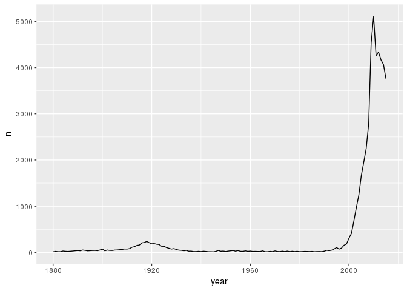
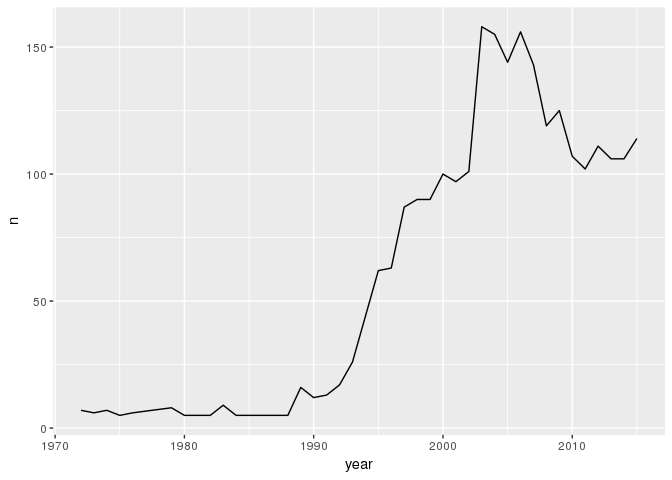
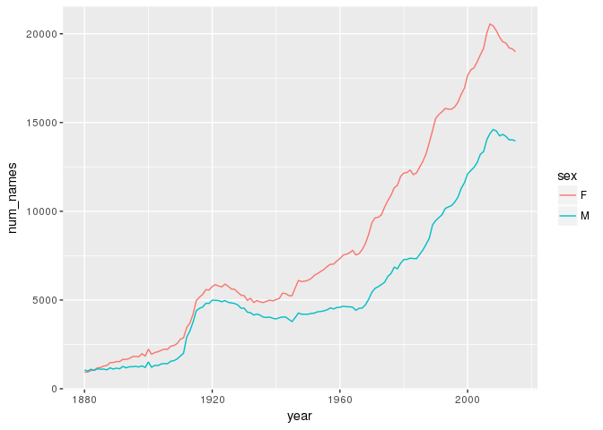
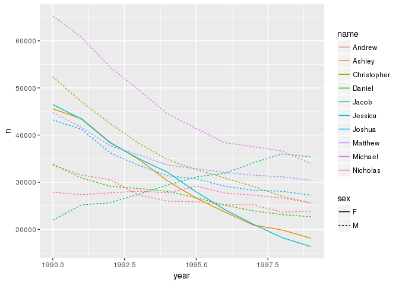
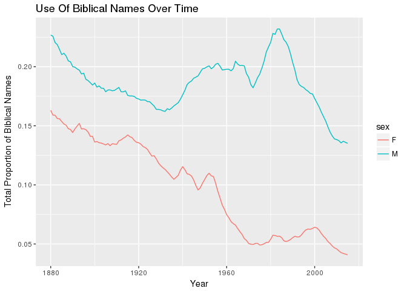
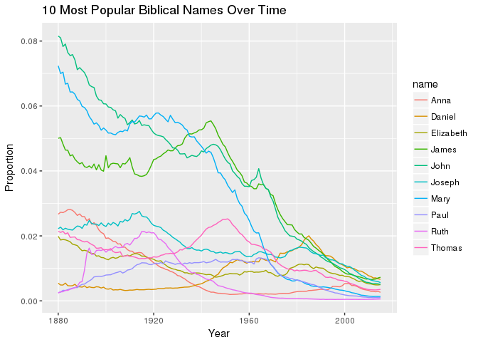

Activity-3
================
Canyon Foot
2/6/2018

The least popular popular names are shown in the table below.

``` r
babynames %>%
  mutate(is_popular = prop > .01) %>%
  filter(is_popular == TRUE) %>%
  arrange(prop)
```

    ## # A tibble: 3,875 x 6
    ##     year sex   name         n   prop is_popular
    ##    <dbl> <chr> <chr>    <int>  <dbl> <lgl>     
    ##  1  1894 F     Grace     2361 0.0100 T         
    ##  2  1969 F     Karen    17637 0.0100 T         
    ##  3  1983 F     Crystal  17904 0.0100 T         
    ##  4  2000 F     Madison  19967 0.0100 T         
    ##  5  1960 M     Gary     21688 0.0100 T         
    ##  6  1911 F     Florence  4424 0.0100 T         
    ##  7  1967 M     Eric     17828 0.0100 T         
    ##  8  1957 M     Larry    21913 0.0100 T         
    ##  9  2003 M     Daniel   21032 0.0100 T         
    ## 10  1934 M     Frank    10635 0.0100 T         
    ## # ... with 3,865 more rows

Bella was most common in the late 2000s and early 2010s. I wonder if there was a popular series of books and movies featuring a main character named "Bella" that was released during this period...

The class of Bella is "tbl\_df"

``` r
bella <- babynames %>% filter(name == "Bella" & sex == "F") %>% select(year,sex,name,n)
ggplot(bella, aes(x = year, y = n)) + geom_line()
```



``` r
class(bella)
```

    ## [1] "tbl_df"     "tbl"        "data.frame"

``` r
bella %>% arrange(desc(n))
```

    ## # A tibble: 136 x 4
    ##     year sex   name      n
    ##    <dbl> <chr> <chr> <int>
    ##  1  2010 F     Bella  5112
    ##  2  2009 F     Bella  4530
    ##  3  2012 F     Bella  4337
    ##  4  2011 F     Bella  4257
    ##  5  2013 F     Bella  4166
    ##  6  2014 F     Bella  4067
    ##  7  2015 F     Bella  3760
    ##  8  2008 F     Bella  2783
    ##  9  2007 F     Bella  2252
    ## 10  2006 F     Bella  1953
    ## # ... with 126 more rows

My name was most popular in 2003, with n = 158. The most popular name that year was Jacob.

``` r
babynames %>% filter(name == "Canyon" & sex == "M") %>% arrange(desc(n))
```

    ## # A tibble: 39 x 5
    ##     year sex   name       n      prop
    ##    <dbl> <chr> <chr>  <int>     <dbl>
    ##  1  2003 M     Canyon   158 0.0000753
    ##  2  2006 M     Canyon   156 0.0000712
    ##  3  2004 M     Canyon   155 0.0000734
    ##  4  2005 M     Canyon   144 0.0000678
    ##  5  2007 M     Canyon   143 0.0000646
    ##  6  2009 M     Canyon   125 0.0000590
    ##  7  2008 M     Canyon   119 0.0000547
    ##  8  2015 M     Canyon   114 0.0000562
    ##  9  2012 M     Canyon   111 0.0000549
    ## 10  2010 M     Canyon   107 0.0000522
    ## # ... with 29 more rows

``` r
babynames %>% filter(year == 2003) %>% arrange(desc(n))
```

    ## # A tibble: 31,179 x 5
    ##     year sex   name        n   prop
    ##    <dbl> <chr> <chr>   <int>  <dbl>
    ##  1  2003 M     Jacob   29620 0.0141
    ##  2  2003 M     Michael 27111 0.0129
    ##  3  2003 F     Emily   25685 0.0128
    ##  4  2003 M     Joshua  25087 0.0119
    ##  5  2003 M     Matthew 23992 0.0114
    ##  6  2003 F     Emma    22701 0.0113
    ##  7  2003 M     Andrew  22146 0.0105
    ##  8  2003 M     Ethan   21354 0.0102
    ##  9  2003 M     Joseph  21352 0.0102
    ## 10  2003 M     Daniel  21032 0.0100
    ## # ... with 31,169 more rows

``` r
babynames %>% filter(name == "Canyon" & sex == "M") %>% arrange(desc(n)) %>% ggplot(aes(x = year, y = n)) + geom_line()
```

 1957 had the highest number of Births.

``` r
bab <- babynames %>% group_by(year) %>% summarise(count = sum(n))
bab %>% arrange(desc(count))
```

    ## # A tibble: 136 x 2
    ##     year   count
    ##    <dbl>   <int>
    ##  1  1957 4200146
    ##  2  1959 4156617
    ##  3  1960 4154877
    ##  4  1961 4140040
    ##  5  1958 4131784
    ##  6  1956 4121274
    ##  7  1962 4035565
    ##  8  1955 4012757
    ##  9  2007 3992280
    ## 10  1954 3979147
    ## # ... with 126 more rows

``` r
babynames %>% group_by(name) %>% summarise(early = min(year), late = max(year))
```

    ## # A tibble: 95,025 x 3
    ##    name      early  late
    ##    <chr>     <dbl> <dbl>
    ##  1 Aaban      2007  2015
    ##  2 Aabha      2011  2015
    ##  3 Aabid      2003  2003
    ##  4 Aabriella  2008  2015
    ##  5 Aada       2015  2015
    ##  6 Aadam      1987  2015
    ##  7 Aadan      2003  2015
    ##  8 Aadarsh    2000  2015
    ##  9 Aaden      2001  2015
    ## 10 Aadesh     2005  2011
    ## # ... with 95,015 more rows

I does appear that recently there was a fairly sharp increase in the number of distinct names. This effect seems somewhat stronger for female names.

``` r
babynames %>% group_by(year, sex) %>% mutate(num_names = n_distinct(name)) %>% 
  ggplot(aes(x = year, y = num_names, color = sex)) + geom_line()
```

 The most popular names of the 1990s were Andrew, Ashley, CHristopher, Daniel, Jacob, Jessica, Joshua, Matthew, Michael, and Nicholas.

``` r
babynames %>% filter(year >= 1990, year < 2000, prop > .0005) %>% group_by(name) %>% mutate(total_prop = sum(prop)) %>% filter(total_prop > .13) %>%
  ggplot(aes(x = year, y = n, color = name, linetype = sex)) + geom_line()
```



``` r
Men_of_The_Bible <- c("Aaron", "Abel", "Abraham", "Adam", "Andrew", "Asher","Barak","Barnabas","Bartholomew","Benjamin","Daniel","Elijah","Elon","Ephraim",
"Ezekiel","Gabriel","Gad","Gideon","Hillel","Hiram","Immanuel","Isaac","Ishmael",
"Israel","Jabin","Jacob","James","Jared","Jesse","Jesus","Jethro","Joel","John","Jokim","Joseph","Joshua","Josiah","Judah","Levi","Lucas","Luke","Mark","Matthew","Meshach","Micah","Moses","Noah","Paul","Peter","Philip","Reuben","Rufus","Samson","Saul","Seth","Silas","Simon","Solomon","Stephen","Thaddeus","Thomas","Timothy", "Zacharias")

Women_of_the_Bible <- c("Abigail", "Ada", "Ahlai", "Angel", "Anna", "Apphia", "Atarah", "Athaliah", "Bathsheba", "Bilhah", "Candace", "Chloe", "Claudia", "Damaris", "Deborah", "Delilah", "Diana", "Dinah", "Elizabeth", "Esther", "Eunice", "Eve", "Hagar", "Hannah", "Huldah", "Jedidah", "Jezebel", "Joanna", "Judith", "Julia", "Leah", "Lois", "Lydia", "Martha", "Mary", "Michaiah", "Milcah", "Miriam", "Naarah", "Naomi", "Orpah", "Phebe", "Priscilla", "Rachel", "Rebecca", "Ruth", "Salome", "Sapphira", "Sarai", "Sherah", "Susanna", "Tabitha", "Tamar", "Tirza", "Vashti", "Zilpah")

# To view the popularity of Biblical names I created two vectors, "Women_of_the_Bible" and "Men_of_the_Bible" that each contain ~50 of the most common Biblical names, then filtered for names included in these vectors. 
babynames %>%
  filter((sex == "M" & name %in% Men_of_The_Bible) | (sex == "F" & name %in% Women_of_the_Bible)) %>%
  group_by(year, sex) %>% 
  mutate(total_prop = sum(prop)) %>%
  ggplot(aes(x = year, y = total_prop, color = sex)) + geom_line() + labs(x = "Year", y = "Total Proportion of Biblical Names", title  = "Use Of Biblical Names Over Time")
```



``` r
# Tracking Pppular Biblical names over time. I used "sum(prop) > .007 * 135" to find the names with the highest average proportion over the 135 years of the data. Note that this may exclude popular biblical names that were only popular for a short period of time.

babynames %>% group_by(name) %>%
  filter((sex == "M" & name %in% Men_of_The_Bible) & sum(prop) > .007 * 135 | (sex == "F" & name %in% Women_of_the_Bible & sum(prop) > .007 * 135)) %>%
  group_by(year) %>% 
  ggplot(aes(x = year, y = prop, color = name)) + geom_line() + labs(x = "Year", y = "Proportion", title  = "10 Most Popular Biblical Names Over Time")
```


